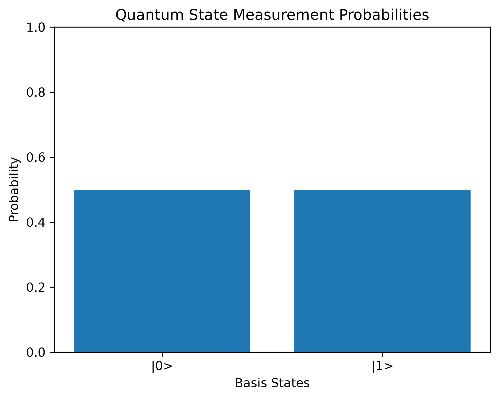

# Quantum State Analyzer using NumPy

## Overview

This project is a simple **Quantum State Analyzer** built using Python, NumPy, and Matplotlib.

The main goal of this project is to understand how fundamental quantum-computing concepts can be represented using vectors, matrices, tensor products, probability calculations, and linear algebra.

The project covers:

* Quantum state representation
* State normalization
* Measurement probabilities
* Pauli-X gate
* Hadamard gate
* Quantum superposition
* Two-qubit basis states
* Tensor products
* Identity matrices
* Applying gates to individual qubits
* Expectation value calculation
* Probability visualization using Matplotlib

---

## Technologies Used

* Python
* NumPy
* Matplotlib
* Linear Algebra
* Quantum Computing Fundamentals

---

## 1. Creating a Quantum State

A quantum state can be represented using a NumPy array.

```python
import numpy as np

quantum_state = np.array([1, 1], dtype=complex)
```

The initial state is:

$$
|\psi\rangle =
\begin{bmatrix}
1 \
1
\end{bmatrix}
$$

This state is not normalized yet.

---

## 2. Quantum State Normalization

A valid quantum state must satisfy:

$$
\langle \psi | \psi \rangle = 1
$$

The norm of the state is:

\sqrt{|1|^2 + |1|^2}

\sqrt{2}
$$

The normalized state is:

\frac{1}{\sqrt{2}}
\begin{bmatrix}
1 \
1
\end{bmatrix}
$$

This can also be written as:

\frac{1}{\sqrt{2}}
\left(
|0\rangle + |1\rangle
\right)
$$

Using NumPy:

```python
norm = np.linalg.norm(quantum_state)

quantum_normalized = quantum_state / norm
```

The output is approximately:

```text
[0.70710678+0.j 0.70710678+0.j]
```

---

## 3. Measurement Probabilities

Quantum amplitudes are not probabilities directly.

The probability of measuring a basis state is calculated using the squared magnitude of its amplitude:

$$
P(i) = |\psi_i|^2
$$

Using NumPy:

```python
probabilities = np.abs(quantum_normalized) ** 2
```

For the current state:

$$
P(0) = 0.5
$$

and

$$
P(1) = 0.5
$$

Therefore:

$$
P(0) + P(1) = 1
$$

---

## 4. Measurement Probability Visualization

Matplotlib is used to visualize the probabilities of measuring the state as `|0>` or `|1>`.

```python
import matplotlib.pyplot as plt

basis_states = ["|0>", "|1>"]

plt.bar(basis_states, probabilities)

plt.xlabel("Basis State")
plt.ylabel("Probability")
plt.title("Quantum State Measurement Probabilities")
plt.ylim(0, 1)

plt.savefig(
    "measurement_probability.png",
    dpi=300,
    bbox_inches="tight"
)

plt.show()
```

### Output

The two equal bars represent:

$$
P(0) = 0.5
$$

and

$$
P(1) = 0.5
$$
## Measurement Probability Visualization

The plot below shows the probability of measuring the quantum state as `|0>` or `|1>`.



---

## 5. Computational Basis States

The two single-qubit computational basis states are:

$$
|0\rangle =
\begin{bmatrix}
1 \
0
\end{bmatrix}
$$

and

$$
|1\rangle =
\begin{bmatrix}
0 \
1
\end{bmatrix}
$$

In NumPy:

```python
state_0 = np.array([1, 0])
state_1 = np.array([0, 1])
```

---

## 6. Pauli-X Gate

The Pauli-X gate behaves similarly to a classical NOT gate.

Its matrix representation is:

$$
X =
\begin{bmatrix}
0 & 1 \
1 & 0
\end{bmatrix}
$$

In NumPy:

```python
X_gate = np.array([
    [0, 1],
    [1, 0]
])
```

Applying it to the basis states gives:

$$
X|0\rangle = |1\rangle
$$

and

$$
X|1\rangle = |0\rangle
$$

Using NumPy:

```python
print(X_gate @ state_0)
print(X_gate @ state_1)
```

---

## 7. Hadamard Gate

The Hadamard gate is commonly used to create quantum superposition.

Its matrix representation is:

$$
H =
\frac{1}{\sqrt{2}}
\begin{bmatrix}
1 & 1 \
1 & -1
\end{bmatrix}
$$

In NumPy:

```python
H_gate = (1 / np.sqrt(2)) * np.array([
    [1, 1],
    [1, -1]
])
```

Applying the Hadamard gate to `|0>` gives:

\frac{1}{\sqrt{2}}
\left(
|0\rangle + |1\rangle
\right)
$$

Applying the Hadamard gate to `|1>` gives:

\frac{1}{\sqrt{2}}
\left(
|0\rangle - |1\rangle
\right)
$$

Using NumPy:

```python
superposition_0 = H_gate @ state_0
superposition_1 = H_gate @ state_1
```

Both states produce the same immediate measurement probabilities:

$$
[0.5,\ 0.5]
$$

However, the relative phase is different.

---

## 8. Two-Qubit Basis States

Two-qubit states can be created using the tensor product.

In NumPy, the tensor product is calculated using:

```python
np.kron()
```

The four computational basis states are:

$$
|00\rangle =
\begin{bmatrix}
1 \
0 \
0 \
0
\end{bmatrix}
$$

$$
|01\rangle =
\begin{bmatrix}
0 \
1 \
0 \
0
\end{bmatrix}
$$

$$
|10\rangle =
\begin{bmatrix}
0 \
0 \
1 \
0
\end{bmatrix}
$$

$$
|11\rangle =
\begin{bmatrix}
0 \
0 \
0 \
1
\end{bmatrix}
$$

Using NumPy:

```python
state_00 = np.kron(state_0, state_0)
state_01 = np.kron(state_0, state_1)
state_10 = np.kron(state_1, state_0)
state_11 = np.kron(state_1, state_1)
```

For a two-qubit system, the state vector contains:

$$
2^2 = 4
$$

amplitudes.

In general, an `n`-qubit system requires:

$$
2^n
$$

amplitudes.

---

## 9. Identity Matrix

The identity operator for a single qubit is:

$$
I =
\begin{bmatrix}
1 & 0 \
0 & 1
\end{bmatrix}
$$

In NumPy:

```python
I = np.eye(2)
```

The identity matrix leaves a quantum state unchanged.

---

## 10. Applying a Gate to the Second Qubit

For a two-qubit system, tensor products can be used to apply a quantum gate to only one qubit.

To apply the Pauli-X gate to the second qubit:

$$
I \otimes X
$$

Using NumPy:

```python
IX = np.kron(I, X_gate)

result_second = IX @ state_00
```

This transformation gives:

$$
|00\rangle
\rightarrow
|01\rangle
$$

The first qubit remains unchanged while the second qubit is flipped.

---

## 11. Applying a Gate to the First Qubit

To apply the Pauli-X gate to the first qubit:

$$
X \otimes I
$$

Using NumPy:

```python
XI = np.kron(X_gate, I)

result_first = XI @ state_00
```

This gives:

$$
|00\rangle
\rightarrow
|10\rangle
$$

This demonstrates that the position of an operator in the tensor product determines which qubit it acts on.

---

## 12. Expectation Value

The expectation value of an observable $A$ is calculated using:

$$
\langle\psi|A|\psi\range
$$

For this project, the Pauli-Z operator is used:

$$
Z =
\begin{bmatrix}
1 & 0 \
0 & -1
\end{bmatrix}
$$

In NumPy:

```python
Z_gate = np.array([
    [1, 0],
    [0, -1]
])
```

The expectation value is calculated using:

```python
expectation_value = (
    quantum_normalized.conj().T
    @ Z_gate
    @ quantum_normalized
)
```

For the state:

\frac{1}{\sqrt{2}}
\left(
|0\rangle + |1\rangle
\right)
$$

the expectation value of the Pauli-Z operator is:

$$
\langle Z \rangle = 0
$$

Expectation values are especially important in variational quantum algorithms such as the **Variational Quantum Eigensolver (VQE)**.

---

## NumPy Concepts Practiced

This project uses several important NumPy operations:

```text
np.array()
np.linalg.norm()
np.abs()
np.sum()
np.sqrt()
np.eye()
np.kron()
```

Matrix multiplication is performed using:

```python
A @ B
```

For complex quantum states:

```python
psi.conj().T
```

calculates the complex conjugate transpose of the state vector.

---

## What I Learned

Through this project, I learned how NumPy can be used to implement basic quantum-computing concepts using linear algebra.

The project helped me understand:

* How quantum states are represented using vectors
* Why quantum states must be normalized
* How amplitudes are converted into measurement probabilities
* How quantum gates are represented using matrices
* How matrix multiplication changes quantum states
* How the Hadamard gate creates superposition
* How tensor products are used to construct multi-qubit systems
* How identity matrices help apply gates to individual qubits
* How expectation values are calculated
* How NumPy operations connect directly with quantum mechanics

---

## Future Improvements

Future improvements to this project may include:

* Pauli-Y gate
* Pauli-Z gate simulation
* Phase gates
* CNOT gate
* Bell-state generation
* Quantum entanglement
* Multiple quantum-gate sequences
* Additional Matplotlib visualizations
* Bloch-sphere visualization
* Hamiltonian construction
* Eigenvalue and eigenvector calculations
* Ground-state energy calculations
* Variational Quantum Eigensolver implementation
* Comparison with Qiskit
* Comparison with PennyLane

---

## Author

**Sanju R**

Interested in quantum computing, Python, numerical simulation, linear algebra, and variational quantum algorithms.
